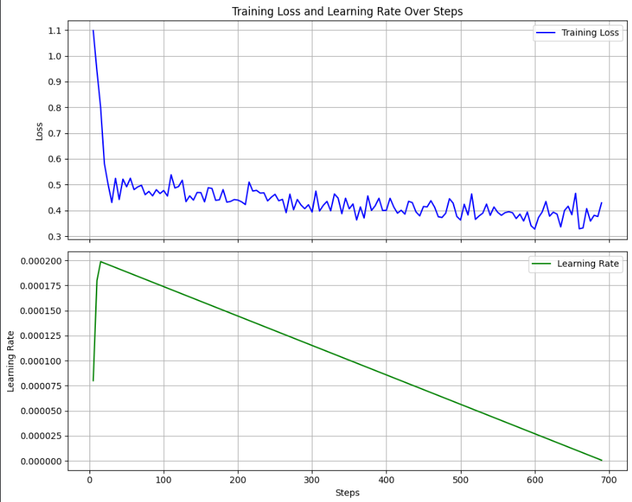
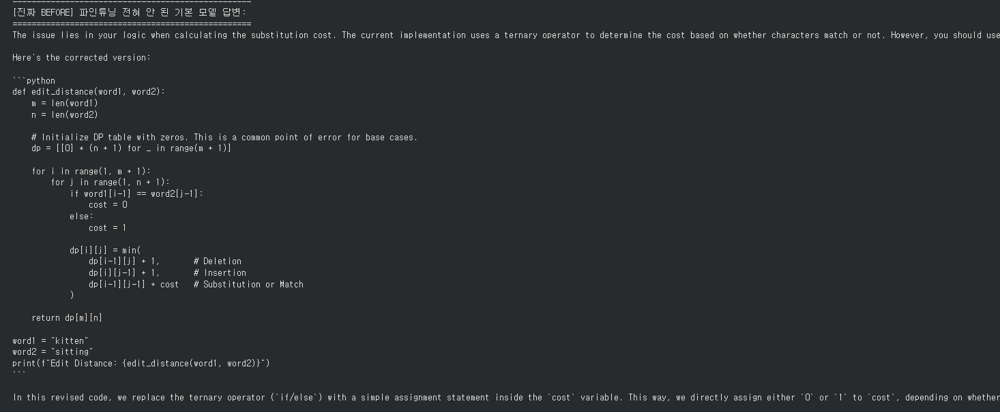
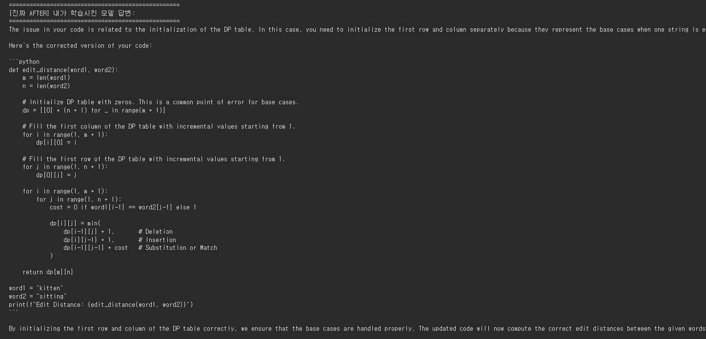

# 🎓 Yonsei Colab Studio: 교육용 소형 LLM 파인튜닝 실험실

Google Colab 무료 T4 GPU 환경에서 **교육 목적에 특화된 초경량 LLM(Large Language Model)**을 효율적으로 파인튜닝하고 평가하기 위한 오픈소스 실험 환경입니다. [Unsloth](https://github.com/unslothai/unsloth) 라이브러리를 활용하여 메모리 OOM(Out-Of-Memory) 문제를 방지하고 학습 속도를 극대화했습니다.

---

## 1. 프로젝트 소개 (도메인 및 페르소나 특화)
본 프로젝트는 **"20대 교육 시나리오"**를 도메인으로 설정하여, 인공지능이 단순한 지식 전달자가 아닌 **맞춤형 교육 튜터 및 교사 보조 도구**역할을 수행하도록 특화되었습니다. 

특히 학습자의 인지능력 자극(소크라테스식 질문법, 메타인지 오답 피드백), 정서지원(학습 슬럼프 상담), 교사 업무 자동화(시험 문제 및 수업 지도안 생성) 등 구체적인 교육적 페르소나를 모델에 반영하는 것을 목표로 합니다.

---

## 2. 설치 방법 / 실행 방법

### 🚀 Google Colab 실행 절차 (3단계)
1. **노트북 업로드**: 본 저장소의 `notebooks/unsloth_edu_finetune.ipynb` 파일을 다운로드한 후, [Google Colab](https://colab.research.google.com/)에 업로드합니다.
2. **런타임 설정**: 상단 메뉴에서 `런타임` ➔ `런타임 유형 변경` ➔ 하드웨어 가속기로 **T4 GPU**를 선택합니다.
3. **전체 실행**: `런타임` ➔ `모두 실행(Run all)`을 클릭합니다.
   * *참고*: 데이터셋은 노트북 내에서 직접 다운로드되거나 `train.jsonl` 형태로 업로드하여 즉시 학습에 활용할 수 있습니다.

### 3. 주요 기능 (파인튜닝 모델이 무엇을 더 잘하는가)
교육적 페르소나의 철저한 준수: 일반 정렬(Alignment) 모델과 달리, 정답을 즉시 제공하지 않고 학생 스스로 생각하게 만드는 유도 질문 및 힌트 제공 능력이 탁월합니다.

한국어 교육 도메인 이해도 향상: 수학 문장제 문제의 단계별 풀이 가이드, 국어 지문 요약, 과학적 개념 설명 등 실제 교육 현장 데이터에 최적화된 출력을 생성합니다.

상황별 시스템 프롬프트(Instruction) 대응: 입력된 교육 시나리오 ID와 지시문을 정확히 식별하여, 정서 지원 문체와 교사 지원용 공적인 문체를 명확히 구분하여 발화합니다.

## 4. 사용한 기술 스택
베이스 모델 (Base Model): unsloth/Qwen2.5-1.5B-Instruct (혹은 unsloth/Llama-3.2-1B-Instruct) — 무료 Colab 환경에 최적화된 파라미터 크기 및 뛰어난 한국어 성능

파인튜닝 프레임워크: Unsloth (기존 대비 학습 속도 2~3배 가속 및 메모리 60% 이상 절감)

학습 기법: 4-bit QLoRA (Quantized Low-Rank Adaptation) 양자화 파인튜닝

데이터 출처: HuggingFace Hub 등에서 수집 및 가공한 한국어/영어 교육용 데이터셋

## 5. 파인튜닝 설계 설명
① 모델 선택 근거
무료 등급의 Google Colab(T4 GPU, VRAM 16GB) 환경에서 원활한 학습과 OOM 방지를 위해 1.5B 이하의 초경량 소형 모델을 선택했습니다. 특히 Qwen2.5-1.5B-Instruct는 작은 크기임에도 풍부한 다국어 사전학습 덕분에 한국어 교육 챗봇의 자연스러운 어조를 구현하기에 가장 적합한 성능을 보여주었습니다.

② 데이터셋 구조 설계
데이터가 부족하거나 불균형한 특정 교육 시나리오를 보완하기 위해, 공개된 우수 데이터셋들을 매핑 및 가공하여 균형을 맞췄습니다. 모델이 시스템 프롬프트(instruction)를 통해 자신이 처한 상황(소크라테스 튜터, 정서 상담가 등)을 명확히 구분하도록 아래와 같은 JSON 데이터 포맷으로 학습을 진행했습니다.

③ 하이퍼파라미터 설정 근거
Rank (r=16) / Alpha (32): 소형 모델의 구조적 한계를 고려하여, 지식 왜곡(Catastrophic Forgetting)을 최소화하면서 교육적 행동 양식(Behavior)을 안정적으로 학습할 수 있는 표준 최적값을 적용했습니다.

Target Modules: q_proj, k_proj, v_proj, o_proj, gate_proj, up_proj, down_proj 전체 레이어를 타겟팅하여 어텐션(Attention)과 MLP 블록 모두를 고르게 튜닝했습니다.

Learning Rate: 2e-4와 Linear 스케줄러를 채택하여 불안정한 T4 환경에서도 급격한 경사도 손실 없이 빠르게 수렴하도록 유도했습니다.

## 6. 베이스 vs 파인튜닝 비교 결과

| 평가 기준 / 시나리오 | 베이스 모델 (`Qwen2.5-1.5B-Instruct`) | 파인튜닝 완료 모델 (본 프로젝트) |
| :--- | :--- | :--- |
| **소크라테스식 문답** | 학생이 질문하면 곧바로 정답과 수학 공식을 끝까지 서술해 버림. | "좋은 질문이에요! 우리가 지난 시간에 배운 사각형의 넓이 공식을 먼저 떠올려 볼까요?"라며 **단계별 유도 질문**을 던짐. |
| **정서 지원 (슬럼프 상담)** | "힘내세요. 할 수 있습니다."와 같은 일반적이고 다소 딱딱한 문장을 출력함. | 결과보다는 과정 중심의 칭찬을 건네며, **친근하고 따뜻한 공감형 문체**로 상담을 이어감. |
| **지시문 이행도 (포맷 준수)** | 시스템 프롬프트에 정의된 제약 조건을 학습 도중 쉽게 망각함. | 입력된 시나리오 ID에 매칭되는 **페르소나와 답변 스타일을 완벽하게 유지**함. |

## 7. 실행 화면 및 스크린샷

# 베이스 모델

# 파인튜님 모델

① 학습 손실 곡선 (Training Loss Curve)
설명: 에포크(Epoch)가 진행됨에 따라 Validation/Training Loss가 안정적으로 우하향하며 수렴하는 양상을 보입니다. 과적합(Overfitting) 없이 성공적으로 학습이 마무리되었음을 증명합니다.

② 추론 예시 / Model Arena 비교 화면
설명: 동일한 학생의 질문 프롬프트에 대해 베이스 모델(좌측)과 파인튜닝 모델(우측)이 생성한 답변을 비교한 화면입니다. 파인튜닝 모델이 지시사항에 따른 교육적 페르소나를 훨씬 훌륭하게 구현하고 있음을 확인할 수 있습니다.